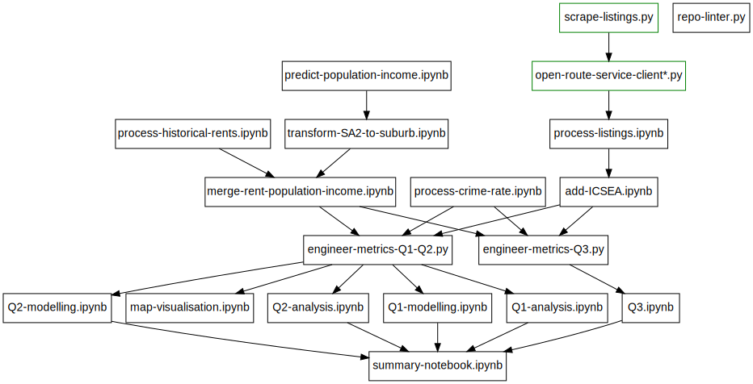

# Generic Real Estate Consulting Project

## Dependencies

Install Python dependencies with

```
pip install -r requirements.txt
```

The notebooks and scripts have the following dependency relations. Please run the code layer by layer.


Artifacts of the green files are already in `data/`, and thus are not strictly necessary to run, see Notes on Running Code for details.

## Style Requirements

Confirm that all code contains docstrings and follows PEP8 guidlines by running

```
python3 scripts/repo-linter.py
```

This checks the jupyter notebooks too.

This is run as a Github Action and the output can be checked on Github by clicking the tick/cross left of the commit hash.

Note, due to the presence of URLs we decided to relax the 79 character line length requirement (with `--ignore=E501`)

## Overview

### Data Processing

`scripts/scrape-listings.py` - used to scrape Realestate.com.au data into `data/raw/realestate.csv`

`notebooks/process-listings.py` - reads scraped data and outputs saves preprocessed data into `data/curated/realestate_coor.csv`

`scripts/open-route-service-client.py` - reads`data/curated/realestate_coor.csv` and wrote `data/curated/realestate_with_closest_distance_duration`

`notebooks/predict-population-income.py` - downloads historical population/incomes and estimates future population/incomes

`notebooks/process-historical-rents.ipynb` - preprocesses historical rental prices by suburb

### Modelling / Analysis

`notebooks/summary-notebook.ipynb` - for an overview

Notebooks for specific questions:
* `notebooks/Q*-analysis.ipynb`
* `models/Q*-modelling.ipynb` 
* `notebooks/Q3.ipynb` 

## Notes on Running Code

`scripts/scrape-listings.py` will require API keys to run, they can be found from the developer options tab when searching www.realestate.com.au

`scripts/open-route-service-client*.py` will require an Open Route Service server to run - ours has been shutdown as of 13/10/22

The easiest way to get an Open Route Service server would be to ask Lachlan.

## LaTeX Plots

To get LaTeX plots you will need to set the following in your `matplotlibrc` file 

```
font.family: serif
text.usetex: True
```

Note that these were not set within the repo as it requires a working latex installation - which most people don't have.

